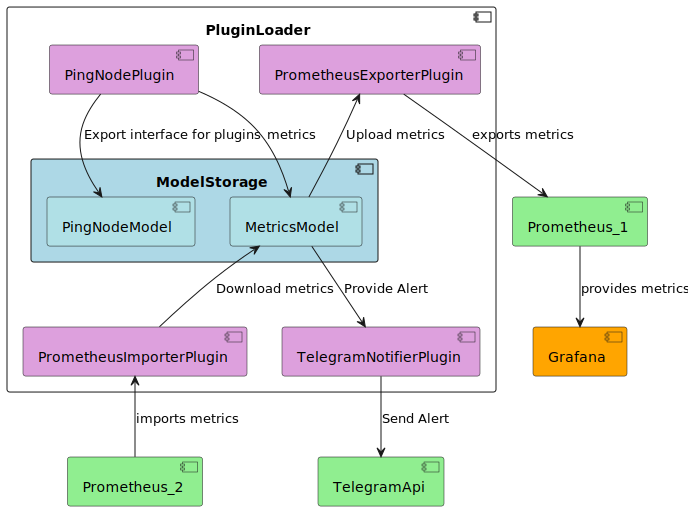

# MetricsModel - Metrics Export, Import and Alerting
`MetricsModel` is a centralized metrics aggregation system that collects metrics from plugins and supports configurable alerting. When alert conditions are met, it forwards alerts to notifier plugins, which deliver notifications to external systems like Telegram, VK, or custom applications.

`MetricsModel` provides centralized metrics aggregation with bi-directional integration:
- Import metrics from external systems via importer plugins ([Prometheus](https://github.com/d3156/PrometheusImporterPlugin), etc.)
- Export metrics to external systems via exporter plugins ([Prometheus](https://github.com/d3156/PrometheusExporterPlugin), Grafana, etc.)
- Internal metrics collection from application plugins
- Alerting with configurable conditions and notifier plugins (Telegram, VK, custom)

## Key Features
- Centralized metrics storage shared across plugins
- Configurable alerting rules with conditions and thresholds
- Plugin-based notification delivery (Telegram, VK, custom apps)
- Automatic metric registration from plugin classes
- Support for tags and multi-condition alerting

## Plugin Integration

Due to static linking encapsulating symbols, each plugin must initialize the shared `MetricsModel` instance:

```cpp
    void registerModels(d3156::PluginCore::ModelsStorage& models) override {
        MetricsModel::instance() = RegisterModel("MetricsModel",new MetricsModel(), MetricsModel);
        
    }
```
After registration, metrics created in plugin classes automatically register with MetricsModel.
## Configuration

Default config file: `./configs/MetricsModel.json`
Example Configuration

```json
{
  "statisticInterval": 5,
  "stopThreadTimeout": 200,
  "notifiers": [
    {
      "metric": "cpu_usage",
      "alert_count": 3,
      "condition": ">=80",
      "tags": ["production", "db"],
      "alertStartMessage": "Alert! {metric} is {value}% high [{tags}]",
      "alertStoppedMessage": "Alert stopped for {metric} [{tags}]"
    }
  ]
}
```
### Configuration Parameters
- `statisticInterval` (seconds) — How often metrics are collected and checked
- `stopThreadTimeout` (ms) — Timeout for stopping the metrics thread
- `notifiers[]` — Array of alert rules:
    - `metric` — Name of metric to monitor
    - `alert_count` — Consecutive occurrences required to trigger alert
    - `condition` — Alert condition (`>=`, `<=`, `=`, `!=`)
    - `tags` — Optional tags filter (array)
    - `alertStartMessage` — Alert trigger message with placeholders: `{metric}`, `{value}`, `{tags}`, `{duration}`
    - `alertStoppedMessage` — Alert recovery message

## Usage
    1. Place notifier plugins in the `Plugins/` folder (e.g., `TelegramNotifierPlugin`, `VKNotifierPlugin`)
    2. Add `MetricsModel.json` to `./configs/` (auto-created with defaults if missing)
    3. Run your application — MetricsModel will:
        - Collect metrics from registered plugins
        - Check conditions per `statisticInterval`
        - Forward alerts to available notifier plugins when conditions trigger

## Example: [PingNode Integration](https://github.com/d3156/PingNode)
Config `./configs/MetricsModel.json`
```json
{
  "statisticInterval": 5,
  "stopThreadTimeout": 200,
  "notifiers": [
    {
      "metric": "PingNodeLatency_gauge",
      "alert_count": 3,
      "condition": ">=500",
      "tags": [],
      "alertStartMessage": "⚠️ Внимание! Задержка сервера [{tags}] превысила порог: {value}мс ",
      "alertStoppedMessage": "✅ Задержка сервера [{tags}] вернулась в норму: {value}мс"
    },
    {
      "metric": "PingNodeAvailable",
      "alert_count": 5,
      "condition": "=0",
      "tags": [],
      "alertStartMessage": "⚠️ Внимание! Сервер [{tags}] недоступен!",
      "alertStoppedMessage": "✅ Сервер снова [{tags}] доступен!"
    }
  ]
}
```
## How It Works
Alert Flow:
- 1. MetricsModel collects and aggregates metrics from all plugins
- 2. Every statisticInterval seconds, it evaluates configured conditions
- 3. When alert_count consecutive conditions are met, it creates an alert
- 4. Alert is forwarded to all available notifier plugins
- 5. Notifiers deliver to Telegram, VK, email, or custom endpoints


